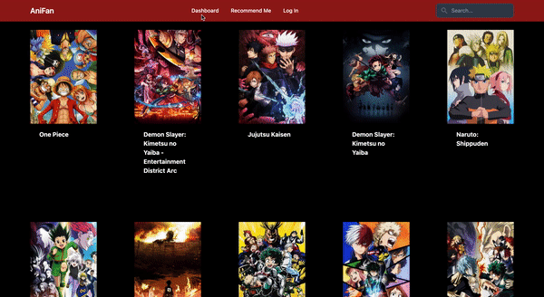

# AniFan

## Description
This webiste was created to help anime viewers find what to watch next. The homepage displays the latest anime shows while the reccomend me page helps users to find what to watch next. It is not a streaming platform. Designed to help people who watch a lot if anime and cannot decide what to watch next.

## Deployed Link

Github link: https://github.com/akaur09/AniFan
heroku link: https://stark-forest-86865.herokuapp.com/ 

## Features

## Creditors

**Lucca Martins** https://github.com/luccaloopz

**Alex Hernandez** https://github.com/Alex-H1

**Amnider Kaur** https://github.com/akaur09 

## Technologies Used

